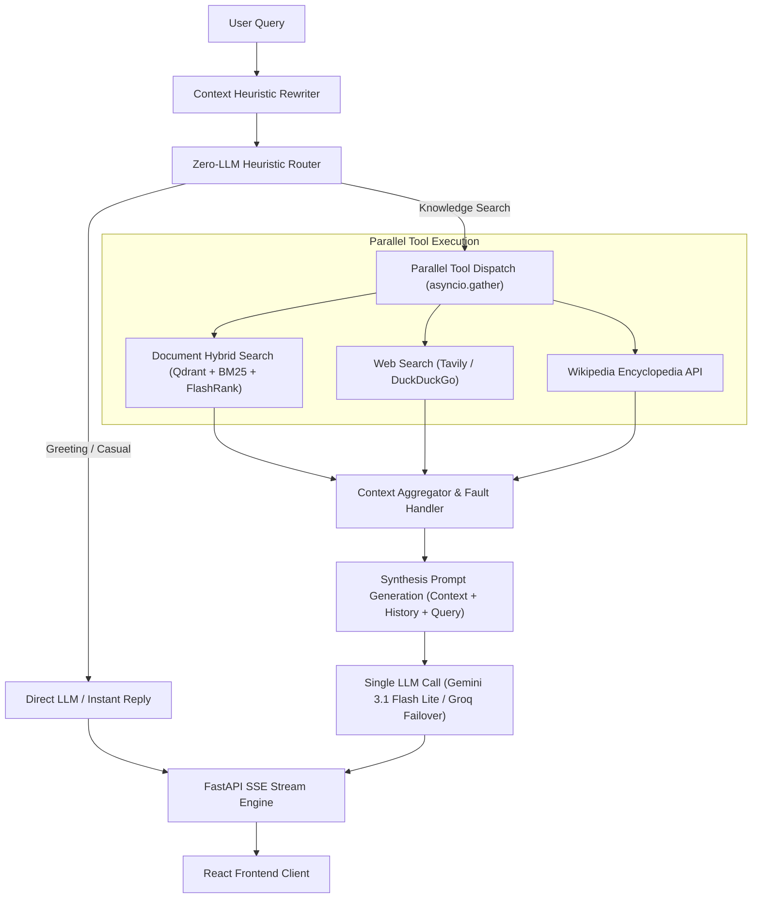

# Enterprise AI Platform with Agentic Retrieval

An enterprise-grade, full-stack **Agentic Retrieval-Augmented Generation (RAG)** platform featuring an autonomous **async Python orchestrator**, **Hybrid Retrieval (Dense Qdrant + Sparse BM25 with Reciprocal Rank Fusion)**, **FlashRank Reranking**, **FastAPI SSE Token Streaming**, a pluggable **Knowledge Ingestion Platform**, and a modern **React + TailwindCSS + Vite** ChatGPT-style interface.

> [!NOTE]
> ### Current LLM Setup (Out of the Box)
> - **Primary LLM**: **Google Gemini 3.1 Flash Lite** (`gemini/gemini-3.1-flash-lite`)
> - **Automated Fallback**: **Groq Llama 3** (`groq/llama3-8b-8192` / `llama-3.3-70b`) for zero-downtime failover
> - **Embeddings**: **Google Gemini Embeddings** (`models/gemini-embedding-001`)
> - **Future-Proof**: Ready to switch to **Anthropic Claude 3.5** or **OpenAI GPT-4o** via LiteLLM with zero code changes.

---

## System Architecture

```text
                                  ┌───────────────────────────────┐
                                  │    React + Vite Frontend      │
                                  │  (Tailwind, SSE, Dark Theme)  │
                                  └──────────────┬────────────────┘
                                                 │ REST / SSE
                                                 ▼
                                  ┌───────────────────────────────┐
                                  │       FastAPI Backend         │
                                  │   (Auth, Streaming, Services) │
                                  └──────────────┬────────────────┘
                                                 │
                                  ┌──────────────▼────────────────┐
                                  │   Async Agent Orchestrator    │
                                  └──────┬─────────────────┬──────┘
                                         │                 │
            ┌────────────────────────────┘                 └────────────────────────────┐
            ▼                                                                           ▼
   [ Direct Conversation ]                                                   [ Knowledge / Agentic Query ]
            │                                                                           │
            ▼                                                                           ▼
┌───────────────────────────────┐                                       ┌───────────────────────────────┐
│        LLM Direct Chat        │                                       │    Parallel Tool Execution    │
│  - Primary: Google Gemini     │                                       │   (asyncio.gather Fan-out)    │
│  - Fallback: Groq Llama 3     │                                       └───────────────┬───────────────┘
└───────────────┬───────────────┘                                                       │
                │                                                    ┌──────────────────┼──────────────────┐
                │                                                    ▼                  ▼                  ▼
                │                                           ┌─────────────────┐ ┌───────────────┐ ┌─────────────────┐
                │                                           │  Hybrid Search  │ │ Wikipedia API │ │ Tavily / DDG    │
                │                                           │ (Qdrant + BM25) │ └───────┬───────┘ │ Web Search      │
                │                                           └────────┬────────┘         │         └────────┬────────┘
                │                                                    │                  │                  │
                │                                                    ▼                  │                  │
                │                                           ┌─────────────────┐         │                  │
                │                                           │ FlashRank       │         │                  │
                │                                           │ Neural Reranker │         │                  │
                │                                           └────────┬────────┘         │                  │
                │                                                    │                  │                  │
                │                                                    └──────────┬───────┴──────────────────┘
                │                                                               │
                │                                                               ▼
                │                                                   ┌───────────────────────────────┐
                │                                                   │ Multi-Source Context Fusion   │
                │                                                   │  (Filter, Dedup & Format)     │
                │                                                   └───────────────┬───────────────┘
                │                                                                   │
                │                                                                   ▼
                │                                                   ┌───────────────────────────────┐
                │                                                   │    1-Call Synthesis Prompt    │
                │                                                   │  - Primary: Google Gemini     │
                │                                                   │  - Fallback: Groq Llama 3     │
                │                                                   └───────────────┬───────────────┘
                │                                                                   │
                └───────────────────────────────┬───────────────────────────────────┘
                                                │
                                                ▼
                                  ┌───────────────────────────────┐
                                  │ Real-Time SSE Token Streaming │
                                  │    (Chunk-by-chunk to UI)     │
                                  └───────────────────────────────┘
```

---

## End-to-End Answer Generation & Retrieval Pipeline

The platform uses a high-performance **single-LLM-call orchestrator** designed to minimize end-to-end latency and eliminate redundant LLM roundtrips:



### Key Latency Optimizations:
1. **Zero-LLM Intent Routing (0ms overhead)**: Rule-based heuristic classification eliminates pre-retrieval LLM routing calls, saving ~600–1000ms.
2. **Parallel Multi-Source Retrieval (`asyncio.gather`)**: Dispatches Document Search, Web Search, and Wikipedia concurrently. Retrieval latency drops from the sum of all APIs ($T_1 + T_2 + T_3 \approx 2.2\text{s}$) to the single slowest call ($\max(T_1, T_2, T_3) \approx 1.0\text{s}$), achieving a **~50%+ latency reduction**.
3. **Resilient Fault Tolerance (`return_exceptions=True`)**: If an external third-party search API fails or times out, the pipeline safely continues with the remaining valid sources without failing the user's request.
4. **Single Synthesis LLM Call**: Aggregates all retrieved evidence into one structured prompt context (`SYNTHESIS_PROMPT`), generating grounded answers with citations in a single generation step.

---

## Key Features

- **Dual-Provider Resilience (Gemini + Groq Fallback)**: Runs **Google Gemini 3.1 Flash Lite** as primary generation engine with automatic, sub-second fallback to **Groq Llama 3** if Google rate-limits or fails.
- **Autonomous Agentic Routing**: A custom rule-and-LLM-based routing engine classifies intent, rewrites queries contextually, and executes parallel tool-calling workflows.
- **Hybrid Search & Reranking**: Combines Dense Vector Search (Google Gemini Embeddings + Qdrant) and Sparse Keyword Search (BM25) via Reciprocal Rank Fusion (RRF), enhanced with FlashRank neural reranking.
- **Pluggable Knowledge Ingestion Platform**: A modular ingestion pipeline (`ingestion_platform/`) with clean abstractions for Connectors (PDF, TXT) and Pipeline Stages (Cleaning, Semantic Chunking, Gemini Embedding, Indexing).
- **Real-Time Token Streaming**: Low-latency Server-Sent Events (SSE) stream tokens and reasoning step updates directly to the frontend.
- **Interactive Citations**: Expandable source attribution citations for retrieved documents.
- **Production Ready**: Multi-stage Dockerfiles, `docker-compose.yml`, Google Cloud Run deployment integration, and Google Cloud Build CI/CD automation.

---

## Technology Stack

| Layer | Technologies |
| :--- | :--- |
| **Frontend** | React 19, Vite, TailwindCSS v4, Lucide React, React Markdown, Remark GFM |
| **Backend API** | FastAPI, Pydantic v2, Uvicorn, Python 3.12 |
| **Active LLM Engine** | **Primary**: Google Gemini (`gemini-3.1-flash-lite`)<br>**Fallback**: Groq (`llama3-8b` / `llama-3.3-70b`)<br>**Gateway**: LiteLLM |
| **Search & Indexing** | Qdrant Vector Database, Gemini Embeddings, Rank-BM25, PyMuPDF, FlashRank Cross-Encoder |
| **Web Search Tools** | Tavily Search API, DuckDuckGo Search, Wikipedia API |
| **DevOps & CI/CD** | Docker, Docker Compose, Google Cloud Build, Pytest |

---

## Quickstart Guide

### Option 1: Run with Docker Compose (Recommended)

1. Clone the repository:
   ```bash
   git clone https://github.com/sushrutha777/Enterprise-AI-Platform-with-Agentic-Retrieval.git
   cd Enterprise-AI-Platform-with-Agentic-Retrieval
   ```

2. Create a `.env` file in the root directory. Here is a complete template of what you can configure:
   ```env
    # Primary AI Model and API Keys
    GOOGLE_API_KEY=your_gemini_api_key_here
    OPENAI_API_KEY=your_openai_api_key_optional
    ANTHROPIC_API_KEY=your_anthropic_api_key_optional
    TAVILY_API_KEY=your_tavily_api_key_optional
    GROQ_API_KEY=your_groq_api_key_optional
    
    # Model Selection
    LLM_MODEL=gemini/gemini-3.1-flash-lite
    EMBEDDING_MODEL=models/gemini-embedding-001
    
    # AI Gateway Configuration
    # [CURRENT STATE]: Leave blank. The app uses an Embedded Gateway to handle Gemini -> Groq fallbacks internally.
    # [FUTURE SCOPE]: Set to a URL (e.g. 'http://localhost:4000') if you deploy a standalone LiteLLM Proxy Server in the future to handle team budgets, API key load balancing, and strict cost tracking.
    LITELLM_API_BASE=
    
    # Vector Database (Qdrant) Configuration
    VECTOR_DB_TYPE=qdrant
    QDRANT_COLLECTION_NAME=agentic_rag_documents
    QDRANT_URL=https://your-cluster-id.cloud.qdrant.io
    QDRANT_API_KEY=your_qdrant_api_key
    
    # Retrieval Tuning Settings
    RETRIEVAL_TOP_K=5
    RERANKED_TOP_K=5
    USE_HYBRID_SEARCH=true
    USE_RERANKER=true
    
    # Application Environment
    ENVIRONMENT=development
    DEBUG=false
    LOG_LEVEL=INFO

    LANGSMITH_TRACING=true
    LANGSMITH_ENDPOINT=https://api.smith.langchain.com
    LANGSMITH_API_KEY=lsv2_pt_your_api_key_here
    LANGSMITH_PROJECT="Agentic RAG"
    ```

3. Launch all services (starts backend API and frontend):
   ```bash
   docker-compose up --build
   ```
   - **Frontend UI**: [http://localhost:3000](http://localhost:3000)
   - **Backend API & Swagger**: [http://localhost:8000/docs](http://localhost:8000/docs)

---

### Option 2: Local Development

#### 1. Backend Setup

```bash
# Create and activate virtual environment
python -m venv .venv
# On Windows:
.venv\Scripts\activate
# On Linux/macOS:
source .venv/bin/activate

# Install dependencies
pip install -r requirements.txt

# Run FastAPI Server
python -m uvicorn app.main:app --port 8000 --reload
```

#### 2. Frontend Setup

```bash
cd frontend

# Install node dependencies
npm install

# Start Vite dev server
npm run dev
```

The application will be live at `http://localhost:5173`.

---

## Knowledge Ingestion Platform

The project includes a robust, independent **Knowledge Ingestion Platform** under [ingestion_platform/](file:///c:/Users/Sushrutha/OneDrive/Desktop/AgenticRAG-with-Web-Search-and-Document-Search/ingestion_platform). This modular platform processes local files and updates the Qdrant vector database.

### Ingestion Pipeline Architecture
- **Connectors**: Extract raw content (e.g., [PDFConnector](file:///c:/Users/Sushrutha/OneDrive/Desktop/AgenticRAG-with-Web-Search-and-Document-Search/ingestion_platform/connectors/pdf.py), [TextConnector](file:///c:/Users/Sushrutha/OneDrive/Desktop/AgenticRAG-with-Web-Search-and-Document-Search/ingestion_platform/connectors/text.py)).
- **Stages**:
  - **DocumentCleaner**: Text sanitization and metadata normalization.
  - **SemanticChunker**: Intelligent chunking of text using semantic boundaries.
  - **GeminiEmbedder**: Generates high-quality vectors using Gemini embeddings.
  - **QdrantIndexer**: Connects to the Qdrant database, manages collections, and uploads vector embeddings.

### How to run ingestion:
You can run the ingestion CLI either via the root helper script or the module directly:

```bash
# Index files from directory (default: ./data)
python ingest.py --source ./data

# Re-index from scratch (drops existing Qdrant collection)
python ingest.py --source ./data --reindex

# Run using the modular CLI entrypoint
python -m ingestion_platform.cli ./data
```

---

## Multi-LLM Provider Switching & AI Gateway Architecture

The platform is designed with a two-phase AI Gateway strategy powered by **LiteLLM**, allowing seamless transitions between model providers (**Google Gemini**, **OpenAI**, **Anthropic Claude**, **Groq**, **AWS Bedrock**) without touching agent business logic.

```text
┌─────────────────────────────────────────────────────────────────────────────┐
│                             AI GATEWAY MODES                                │
│                                                                             │
│  [CURRENT STATE] Embedded In-Process Gateway                                │
│  FastAPI Backend ──(In-Process LiteLLM SDK)──► Gemini / Fallback Groq       │
│                                                                             │
│  [FUTURE SCOPE] Standalone LiteLLM Proxy (When Application Scales)          │
│  FastAPI Backend ──(LITELLM_API_BASE:4000)──► Central AI Gateway Proxy      │
│                                                  │                          │
│                    ┌─────────────────────────────┼─────────────────┐        │
│                    ▼                             ▼                 ▼        │
│              Anthropic Claude              OpenAI GPT-4o     Google / Groq  |
│              (Team A Quota)               (Team B Quota)    (Auto-Fallback) |
└─────────────────────────────────────────────────────────────────────────────┘
```

### 1. Current State: Embedded In-Process Gateway (Active by Default)

> **Active Configuration**:
> - **Primary LLM**: `gemini/gemini-3.1-flash-lite` (via `GOOGLE_API_KEY`)
> - **Automatic Fallback**: `groq/llama-3.3-70b-versatile` or `groq/llama3-8b-8192` (via `GROQ_API_KEY`)
> - **Vector Embeddings**: `models/gemini-embedding-001`

* **How it Works**: The backend uses the embedded Python `litellm` library directly inside [app/llm/gateway.py](file:///c:/Users/Sushrutha/OneDrive/Desktop/AgenticRAG-with-Web-Search-and-Document-Search/app/llm/gateway.py).
* **Zero Infrastructure Overhead**: Runs within the FastAPI process with no extra proxy containers or network hops.
* **Instant Fallback**: If Gemini encounters rate limits (HTTP 429) or temporary outages, LiteLLM automatically shifts to Groq within milliseconds without dropping the user's stream.
* **Switching Models**: Swap models anytime by updating `.env`:

| Provider | Model String (`LLM_MODEL`) | Required API Key in `.env` | Status |
| :--- | :--- | :--- | :--- |
| **Google Gemini** | `gemini/gemini-3.1-flash-lite` | `GOOGLE_API_KEY` | **Active Primary** |
| **Groq Llama** | `groq/llama-3.3-70b-versatile` | `GROQ_API_KEY` | **Active Fallback** |
| **OpenAI** | `gpt-4o` or `gpt-4o-mini` | `OPENAI_API_KEY` | Optional Drop-in |
| **Anthropic Claude** | `claude-3-5-sonnet-20241022` | `ANTHROPIC_API_KEY` | Optional Drop-in |
| **AWS Bedrock** | `bedrock/anthropic.claude-3-5-sonnet-20240620-v1:0` | AWS Credentials | Optional Drop-in |

---

### 2. Future Scope: Standalone LiteLLM Proxy Server (When the Application Scales)

As traffic grows across multiple enterprise teams, departments, or microservices, you can deploy a standalone **LiteLLM Proxy Server** (`ghcr.io/berriai/litellm:main-latest`) to act as a centralized enterprise AI control plane.

#### Why Scale to a Standalone Proxy?
* **Centralized Budget & Cost Management**: Allocate virtual API keys with strict monthly spend limits per department or team.
* **Unified Key Rotation & Governance**: Store enterprise provider API keys in one central gateway rather than distributing them across multiple apps.
* **Zero-Downtime Model Swapping**: Shift traffic from Claude to OpenAI or Gemini globally without modifying or redeploying any application code.
* **Admin Analytics Dashboard**: Web console at `http://localhost:4000/ui` showing real-time token spend, latency graphs (p50/p99), and error rates.
* **Standardized Endpoints**: Exposes 100% OpenAI-compatible `/v1/chat/completions`, `/v1/embeddings`, and `/v1/models` endpoints.

#### Step 1: Create `litellm-config.yaml`
```yaml
model_list:
  # Primary Enterprise Model (Claude 3.5 Sonnet)
  - model_name: enterprise-chat
    litellm_params:
      model: anthropic/claude-3-5-sonnet-20241022
      api_key: "os.environ/ANTHROPIC_API_KEY"

  # Secondary Fallback Model (OpenAI GPT-4o-mini)
  - model_name: gpt-4o-mini
    litellm_params:
      model: gpt-4o-mini
      api_key: "os.environ/OPENAI_API_KEY"

  # Fast Open-Source Fallback (Groq)
  - model_name: groq-llama
    litellm_params:
      model: groq/llama-3.3-70b-versatile
      api_key: "os.environ/GROQ_API_KEY"

litellm_settings:
  fallbacks: [{"enterprise-chat": ["gpt-4o-mini", "groq-llama"]}]
  num_retries: 3
  request_timeout: 30
```

#### Step 2: Run the Proxy Container
```bash
docker run -d \
  --name litellm-proxy \
  -p 4000:4000 \
  -v $(pwd)/litellm-config.yaml:/app/config.yaml \
  -e ANTHROPIC_API_KEY="sk-ant-..." \
  -e OPENAI_API_KEY="sk-..." \
  -e GEMINI_API_KEY="AIzaSy..." \
  -e GROQ_API_KEY="gsk_..." \
  -e LITELLM_MASTER_KEY="sk-master-admin-key" \
  ghcr.io/berriai/litellm:main-latest \
  --config /app/config.yaml --port 4000
```

#### Step 3: Connect this Application to the Proxy
In your `.env`:
```dotenv
# Point backend to the LiteLLM Proxy endpoint
LITELLM_API_BASE=http://localhost:4000

# Use the model alias registered in the proxy configuration
LLM_MODEL=enterprise-chat
```

---

## Running Tests & Benchmark Evaluation

### 1. PyTest Unit & Integration Suite
Run the automated test suite covering vector retrieval, sparse BM25, hybrid fusion, agent intent routing, and metric calculations:
```bash
pytest tests/ -v
```

### 2. Interactive CLI Demo ([`scripts/cli_demo.py`](file:///c:/Users/Sushrutha/OneDrive/Desktop/AgenticRAG-with-Web-Search-and-Document-Search/scripts/cli_demo.py))
Test agent responses and live streaming directly from your terminal:
```bash
python scripts/cli_demo.py
```

### 3. Automated Benchmark Evaluation Suite ([`eval/evaluate_ragas.py`](file:///c:/Users/Sushrutha/OneDrive/Desktop/AgenticRAG-with-Web-Search-and-Document-Search/eval/evaluate_ragas.py))
The platform features an automated benchmark suite across a **52-sample golden dataset** spanning account security, company terms, checkout operations, navigation, and comprehensive shipping & logistics policies:

```bash
# Run full benchmark evaluation across all 52 samples
python eval/evaluate_ragas.py

# Run evaluation on a subset (e.g. 5 samples)
python eval/evaluate_ragas.py --limit 5

# Run evaluation for a specific category (e.g. 'shipping', 'policy', 'account')
python eval/evaluate_ragas.py --category shipping
```

#### Evaluation Benchmark Results (52 Multi-Intent Samples)
| Metric | Platform Score | Benchmark Type | What It Measures |
| :--- | :---: | :---: | :--- |
| **Context Recall** | **`0.9501`** | Mathematical & Grounded | % of ground-truth reference facts captured by hybrid retrieval. |
| **Context Precision** | **`0.9756`** | Mean Reciprocal Rank (MRR) | Quality of ranking: Most relevant chunks placed at top of context. |
| **Faithfulness** | **`0.7934`** | Lexical & LLM Groundedness | Verification that answer claims are supported by retrieved documents. |
| **Answer Relevancy** | **`0.9253`** | Semantic & Token Alignment | Direct alignment of generated responses to the user inquiry. |
| **Retrieval Latency** | **`2.22s`** | Measured (Qdrant + BM25) | Dense vector search, sparse keyword index, and RRF rank fusion. |
| **Generation Latency** | **`2.47s`** | Measured (Gemini 3.1) | Time to stream tokens from agent orchestrator to completion. |
| **Total Latency** | **`4.69s`** | End-to-End | Complete multi-step agent flow with live token streaming. |

* **Dual Evaluation Support**:
  - **LLM-as-a-Judge Mode**: Enabled with `ragas` & `datasets` packages when an LLM evaluation judge is configured.
  - **Empirical Lexical Benchmark Mode**: Native mathematical & lexical evaluation with zero external dependencies.
* **JSON Output**: Persisted in [`eval/ragas_report.json`](file:///c:/Users/Sushrutha/OneDrive/Desktop/AgenticRAG-with-Web-Search-and-Document-Search/eval/ragas_report.json) with per-sample queries, responses, retrieved contexts, and latency profiling.
* **REST API**: Live metrics accessible via `GET /api/v1/eval/metrics` or Swagger UI (`http://localhost:8000/docs`).

---

## Production Observability & Tracing (LangSmith)

The platform natively integrates with **LangSmith** for real-time visual execution tracing, token latency profiling, and automated experiment tracking:

1. Obtain a free API key at [smith.langchain.com](https://smith.langchain.com).
2. Configure your credentials in `.env`:
```env
LANGSMITH_TRACING=true
LANGSMITH_ENDPOINT=https://api.smith.langchain.com
LANGSMITH_API_KEY=lsv2_pt_your_api_key_here
LANGSMITH_PROJECT="Agentic RAG"
```
3. **Live Traces**: Every user chat interaction, LangGraph agent decision, and vector retrieval step automatically streams live trace trees into your LangSmith dashboard.
4. **Dataset Sync**: Running `eval/evaluate_ragas.py` automatically synchronizes benchmark runs to the **Datasets & Testing** tab in LangSmith.

---

## API Documentation

Once the backend is running, explore interactive Swagger API docs at `http://127.0.0.1:8000/docs`:

- `POST /api/v1/chat/stream`: SSE Streaming endpoint for LangGraph RAG.
- `GET /api/v1/health/ready`: Readiness check for API and LLM configurations.
- `POST /api/v1/voice/transcribe`: Transcribe voice inputs (Speech-to-Text).

---

## Google Cloud Platform (GCP) Deployment

The application is fully containerized and includes automated CI/CD pipelines via `cloudbuild.yaml`. When deployed to GCP, the infrastructure is organized as follows:

* **Artifact Registry**: Stores the built, production-ready Docker container images.
* **Secret Manager**: Securely stores all sensitive environment variables and API keys. These are injected into the application dynamically at runtime. The required/optional secrets include:
  * `GOOGLE_API_KEY`: Primary LLM and Embeddings API key.
  * `GROQ_API_KEY`: Fallback LLM API key for high availability.
  * `TAVILY_API_KEY`: Required for the web search agent tool.
  * `QDRANT_API_KEY`: Required for authenticating with the Qdrant Cloud vector database.
  * `OPENAI_API_KEY` / `ANTHROPIC_API_KEY`: (Optional) If using alternate LLM providers.
  * `LANGSMITH_API_KEY`: (Optional) For production observability and execution tracing.
* **Cloud Run**: Hosts the containerized application in a fully managed, serverless environment with auto-scaling capabilities. Non-secret configurations are passed as standard environment variables directly to the Cloud Run service, such as:
  * `ENVIRONMENT`: (e.g., `production`).
  * `LLM_MODEL` / `EMBEDDING_MODEL`: To specify the active AI models.
  * `QDRANT_URL` / `VECTOR_DB_TYPE`: Vector database connection settings.
  * `USE_HYBRID_SEARCH` / `USE_RERANKER`: Feature flags for the retrieval pipeline.

To deploy the application:

```powershell
# Windows PowerShell
.\deploy\deploy-gcp.ps1
```

```bash
# Linux / macOS / Cloud Shell
./deploy/deploy-gcp.sh
```

For complete step-by-step configuration, see the [GCP Deployment Guide](file:///c:/Users/Sushrutha/OneDrive/Desktop/AgenticRAG-with-Web-Search-and-Document-Search/deploy/GCP_DEPLOYMENT.md).
